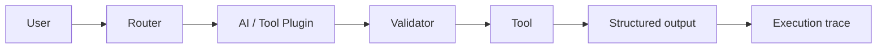

# AI Agent Architecture

The default demo uses deterministic local tools so it can run offline. The optional OpenAI-compatible adapter uses the same application boundary when a real model provider is configured.
