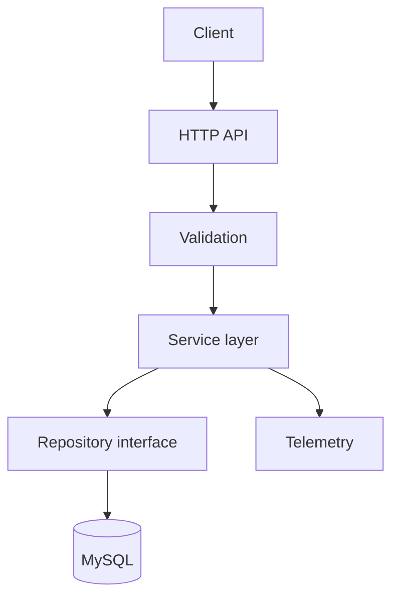

# SaaS API Architecture

```mermaid
flowchart TD
  C[Client] --> H[HTTP API]
  H --> V[Validation]
  V --> S[Service layer]
  S --> R[Repository interface]
  R --> D[(MySQL)]
  S --> T[Telemetry]
```

The default test path is in-memory so the API can run without infrastructure. The MySQL schema and repository are the persistence path when `MYSQL_URL` is supplied.
