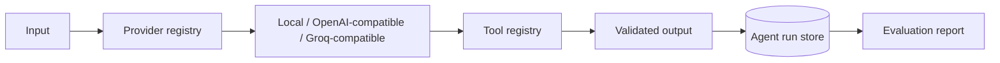

# Production AI Layer

The original deterministic agent lab remains intact. This layer adds a provider registry, a stable tool registry, durable agent-run records, and repeatable provider evaluation.

Remote providers are opt-in through environment variables. The deterministic provider makes CI reproducible without a model API or network dependency.
