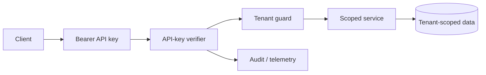

# Production SaaS Layer

API keys are represented by salted scrypt hashes. Rotation revokes the prior record. Tenant identity is explicit at the request boundary, and ownership checks reject resources belonging to another tenant.
