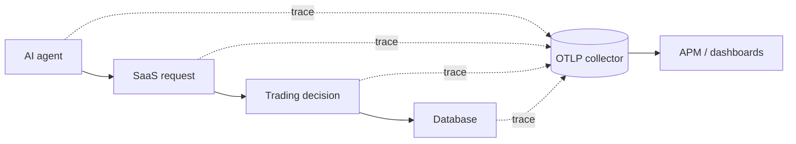

# Production Telemetry

The exporter implements OTLP/HTTP JSON and emits trace spans to the standard `/v1/traces` endpoint when configured.

The local mode is deterministic. Set `OTEL_EXPORTER_OTLP_ENDPOINT` or `OTEL_EXPORTER_OTLP_TRACES_ENDPOINT` to switch to network export.
