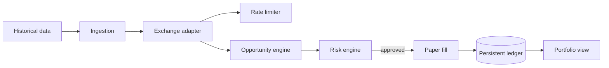

# Production Trading Layer

The original paper-trading labs remain unchanged. This layer adds explicit exchange boundaries, request pacing, historical ingestion, a durable paper ledger, portfolio reconstruction and risk controls.

No live order API is exposed here. A future authenticated exchange implementation can replace the fixture adapter without changing the risk or ledger contracts.
